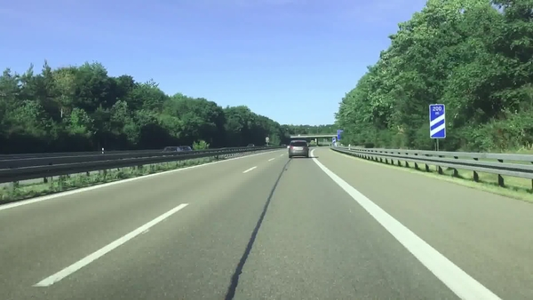
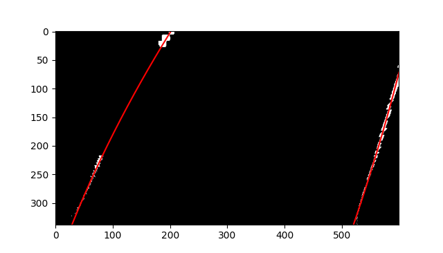

# Computer Vision Lane Detection System

This project is a lane detection system made in python using computer vision techniques. The system is able to detect the bounds of the current lane provided that the car is driving on a highway (minimal bends).

This project was inspired by automaticaddison's [The Ultimate Guide to Real-Time Lane Detection](https://automaticaddison.com/the-ultimate-guide-to-real-time-lane-detection-using-opencv/).

## Requirements

To install requirements

```
pip isntall -r requirements.txt
```

## Configuration

There is a configuration file provided `config.ini` that contains editable parameters for the system. 

### config.ini

```ini
[CLEANING]
Sat_Thresh = 80
Angle_Increment = 0.1
Mid_Redux = 15
Run_Center_Rays = True
```

- `Sat_Thresh` is the threshold for the minimum saturation of the image. This is used to detect the white lines on the road.
- `Angle_Increment` is the increment of the angle used in the ray casting algorithm.
- `Mid_Redux` is the reduction from the horixontal middle of the ROI, this can be modified to remove less of the environment. $\frac{1}{Mid\_Redux}$
- `Run_Center_Rays` is a boolean that determines if the center rays should be run. This can be set to false if the `Angle_Increment` is too large.

## Lane Detection Pipeline

The lane detection pipeline is composed of the following steps:
- Image Saturation Thresholding
- Image Cleaning
    - Noise and large blob removal
- Ray Casting
- Region of Interest
    - ROI selection
- Perspective Transform
- Lane Detection

### Image Saturation Thresholding

#### **Original Image**


#### **Saturation Thresholding**


### Image Cleaning

#### **Noise Removal**

Noise removal uses `cv2.connectedComponentsWithStats` to get a list of all the "blobs" of white pixels, if the blob is smaller than 15 pixels or larger than 20,000 pixels it is removed.


### Ray Casting

Ray casting creates lots of lines origionating from two points, the bottom middle of the image and $\frac{1}{4}$ from the bottom. The rays are casted outwards from the two points and the first white pixel that is detected is drawn onto a new image. This is repeated for every angle increment provided in the configuration file.

The math behind the ray casting is simple pythagorean theorem.
Variables:
- $O$ is the origin of the ray e.g. $(x_0, y_0)$
- $w$ is the width of the image
- $h$ is the height of the image
- $a$ is the angle of the ray
- $L$ is the length of the ray

The final point of the ray is calculated by:
$$M_x = O_x + \frac{w}{2} \cos(a)$$
$$M_y = O_y - \frac{h}{2} \sin(a)$$

The point at any given length $L$ is calculated by:
$$P_x = O_x + L \cos(a)$$
$$P_y = O_y - L \sin(a)$$

Using the above equations we can calculate the pixel at any given length $L$, for any given angle $a$ and use this to get the first white pixel.

#### **Visable rays**

**Bottom**


**Center**


#### **Resulting images**

**Bottom**


**Center**


### Region of Interest

The region of interest is a polygon that is used to select the area of the image that is used for the lane detection. There is a pre-defined ROI that is used. You can see it outlined below.


### Perspective Transform

The images generated from the ray casting process are then perspective transformed to a top-down view. This is done to make the lane detection process easier. The perspective transform is done using `cv2.getPerspectiveTransform` and `cv2.warpPerspective`.


### Lane Detection

The first step in lane detection is to find all the regions where the white pixels are. This is done by using `np.sum` to get the sum of all the white pixels in each column. The results are then plotted on a histogram.


The histogram is then booleaned out to either 1 or 0, where if the value is greater than 0 it is set to 1. The resulting histogram can be seen below.


The peaks of the histogram are detected and put into a list of peaks containing their start and end x coordinates. Any peaks within 100 pixels are combined into one peak. This is done to detect dashed lines.

#### Lane Centers

The centers of each lane are calculated by looping through every row of the image and finding the average x coordinate of the white pixels inside a peak. The resulting centers are then plotted on the image below.


#### Line Fitting

The centers are then fitted to a line using `np.polyfit`. The resulting lines are then plotted on the image below.



All the points are reverse perspective transformed using `cv2.perspectiveTransform` and are then plotted on the original image.

Finally the lane is filled in using `cv2.fillPoly`.

## Results


### An animated gif of the lane detection system in action.

The gif below shows the lane detection system in action. There are many flaws in the system, but it is able to detect the lane in most cases pretty well considering the simplicity of the system.


### Average FPS

| Resolution | Time (S)  | FPS         | Angle Increment (Deg) | Run Center Rays |
|------------|-----------|-------------|-----------------------|-----------------|
| 600x338    | 8.578125  | 0.116575592 | 0.1                   | True            |
| 300x169    | 4.46875   | 0.223776224 | 0.1                   | True            |
| 100x56     | 1.625     | 0.615384615 | 0.1                   | True            |
| 600x338    | 3.734375  | 0.267782427 | 0.2                   | True            |
| 300x169    | 1.78125   | 0.561403509 | 0.2                   | True            |
| 100x56     | 0.6875    | 1.454545455 | 0.2                   | True            |
| 600x338    | 0.9375    | 1.06666667  | 0.5                   | False           |
| 300x169    | 0.3125    | 3.2         | 0.5                   | False           |
| 100x56     | 0.125     | 8           | 0.5                   | False           |